|  |  |  |
| --------------------------- | --------- | ------------------------------------------------------------------------------------ |
| 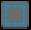        | M         | Rectangle Marquee Tool - Select a rectangular area for copying, moving, transforming, or editing. |
| 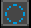  | Shift + M | Elliptical Marquee Tool - Select an elliptical or circular area for editing. |
|         | Q         | Lasso Tool - Make a freehand selection by drawing around an area. |
|   | Shift + Q | Polygonal Lasso Tool - Make a selection using connected straight line segments. |
| 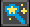        | W         | Magic Wand Tool - Select pixels or tiles with similar properties in a clicked area. |
| 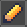        | B         | Pencil Tool - Draw freehand strokes with pixel-perfect precision. |
| 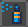  | Shift + B | Brush Tool - Paint using a brush with adjustable size and shape. |
|         | E         | Eraser Tool - Remove pixels or tiles from the current layer. |
| 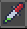        | I         | Eyedropper Tool - Pick a color, tile, or brush settings from the canvas. |
| 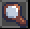        | Z         | Zoom Tool - Zoom in or out for a closer or wider view of the canvas. |
|         | H         | Hand Tool - Move the view around without changing the artwork. |
|         | V         | Move Tool - Move selected content, layers, or objects. |
| 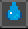        | G         | Paint Bucket Tool - Fill a connected area with the selected color or tile. |
| 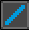        | L         | Line Tool - Draw straight lines between two points. |
|   | Shift + L | Curve Tool - Draw curved lines by defining control points. |
|        | U         | Rectangle Tool - Draw rectangle outlines. |
| 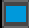       | U         | Filled Rectangle Tool - Draw filled rectangles. |
| 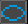 | Shift + U | Ellipse Tool - Draw ellipse or circle outlines. |
|  | Shift + U | Filled Ellipse Tool - Draw filled ellipses or circles. |
|         | D         | Contour Tool - Draw shape outlines using connected line segments. |
|   | Shift + D | Polygon Tool - Draw polygons with multiple sides. |
| 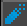       | R         | Blur Tool - Soften pixels by blending neighboring colors together. |
| 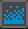       | R         | Jumble Tool - Randomize nearby pixels to create variation and texture. |